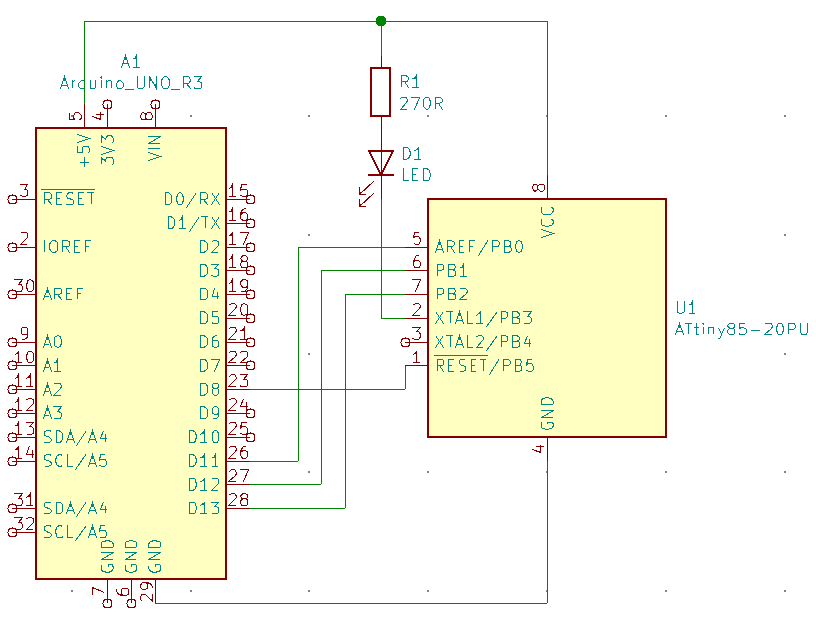

# Program ATtiny85 using Arduino

This project is a way to program ATtiny85, or 25 or 45. Using an Arduino, without using the Arduino ISP and without having to flash a bootloader on the ATtiny.

An binary image of the ATtiny program will be created and flashed with an arduino using SPI commands

## Structure
- ``/attiny85_src`` contains the ATtiny C project
- ``/arduino_attiny85_prog`` contains the Arduino project

## How to run
Run the ``compile.sh`` in the ``/attiny85_src`` which will compile the ``example.c`` ATtiny program into a binary image ready to be flashed on the chip.

``create_header_file.sh`` in the root folder will create a C array (in .h) and add it in the arduino project.

Then launch the ``/arduino_attiny85_prog/arduino_attiny85_prog.ino`` in the arduino IDE and run it. The project will read some fuses, clear the flash and flash the firmware.

## Wiring

Pin 8 of the Arduino is used for the RESET of the ATtiny85

PB3 of the ATtiny is used to drive a LED to ensure that the firmware is flashed